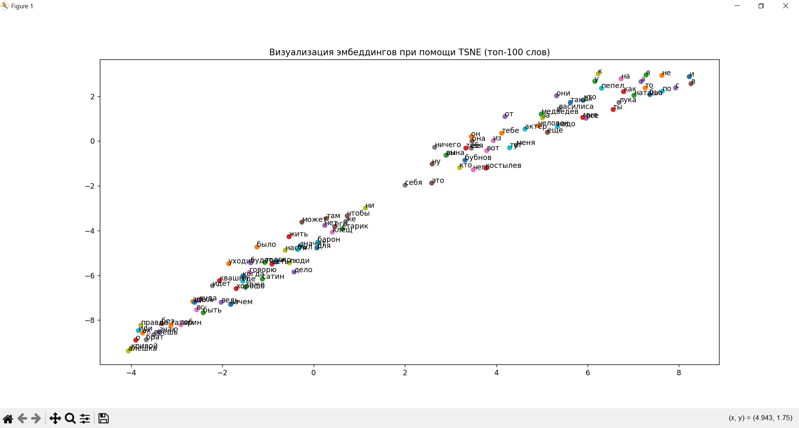
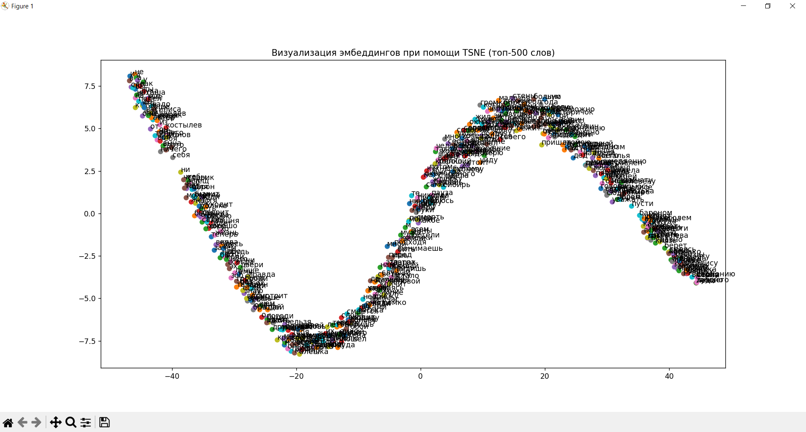
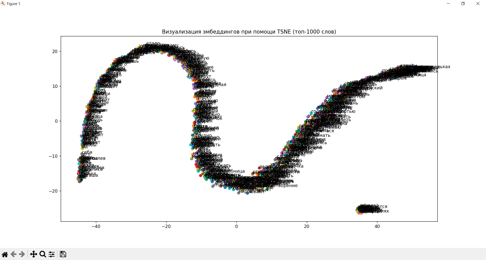
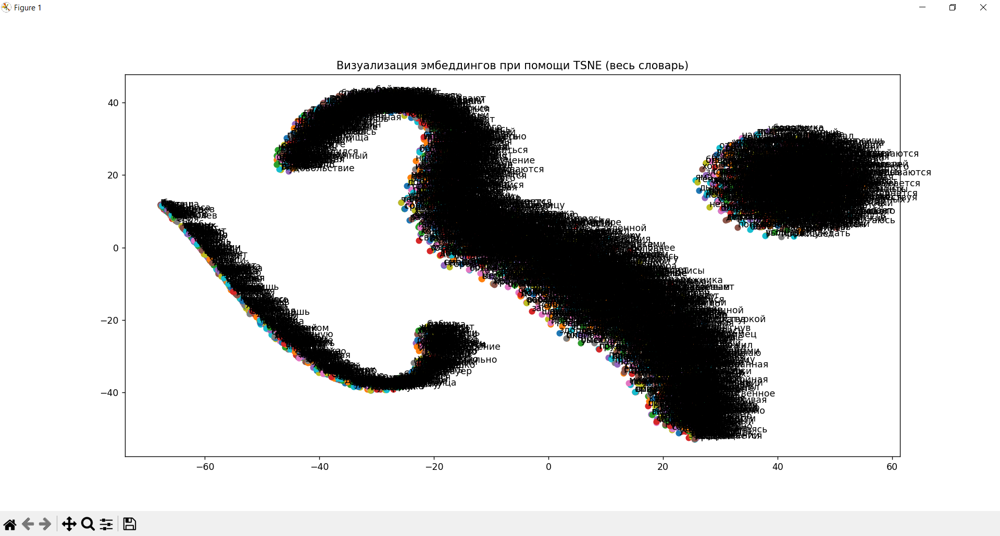

# Отчёт по лабораторной работе: Визуализация векторных представлений слов
Этот проект посвящён визуализации векторных представлений слов (эмбеддингов) с использованием модели Skip-Gram и алгоритма TSNE. Код позволяет визуализировать топ-100, топ-500, топ-1000 слов, а также весь словарь из текста.

## Описание задачи
**Цель работы** — визуализировать векторные представления слов, полученные с помощью модели `Skip-Gram`, и проанализировать их расположение на плоскости. Визуализация помогает понять, как слова с похожей семантикой группируются вместе.

**Используемые библиотеки**
`nltk`: Для токенизации текста.

`gensim`: Для обучения модели Word2Vec (Skip-Gram).

`sklearn`: Для уменьшения размерности с помощью TSNE.

`matplotlib`: Для визуализации данных.

`numpy`: Для работы с массивами.

## Как работает код
**1. Загрузка текста**: текст загружается из файла na-dne.txt.

**2. Препроцессинг**: текст очищается от лишних символов и приводится к нижнему регистру. Текст токенизируется на слова.

**3. Обучение модели Skip-Gram**: модель Word2Vec обучается на токенизированном тексте с использованием алгоритма Skip-Gram.

**4. Получение частот слов**: слова сортируются по частоте их встречаемости в тексте.

**5. Визуализация**: визуализируются топ-100, топ-500, топ-1000 слов, а также весь словарь. Для уменьшения размерности векторов слов используется алгоритм TSNE.

## Результаты
Код генерирует четыре визуализации:

Топ-100 слов:

Топ-500 слов:

Топ-1000 слов:

Весь словарь:

## Анализ результатов
Видно, что слова с похожей семантикой группируются вместе, образуя кластеры. С увеличением объема слов, кластеры становятся более разнообразными, обширными и различимыми.

## Выводы
Визуализация векторных представлений слов с помощью TSNE позволяет анализировать семантическую близость слов. Фильтрация топ-N слов улучшает читаемость визуализации.  Модель Skip-Gram хорошо отражает контекстные связи между словами.
